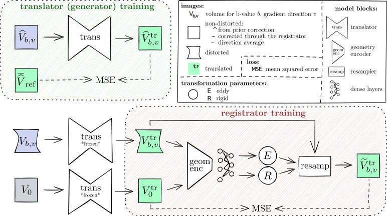

# Eddeep

**Eddeep** is composed of 2 models in sequence:
  1) **Translator**: Restore correspondences between images.
  2) **Registrator**: Estimate the distortion and apply correction.

<p align="center">

</p>

## Installation

```bash
git clone git@github.com:CIG-UCL/eddeep.git
cd eddeep
pip install -r requirements.txt
```


## Training Eddeep

### Preprocessing

#### 1) Pre-correction with an external tool (for translator training only)
During training (but not at inference), the translator takes as input images that have been corrected for eddy distortions by an external tool. You can typically use [FSL Eddy](https://web.mit.edu/fsl_v5.0.10/fsl/doc/wiki/eddy(2f)UsersGuide.html) or [Tortoise](https://tortoise.nibib.nih.gov/tortoise) for that.

#### 2) Creation of the translation targets (for translator training only)
  - Choose a moderately high (700-3000) b-value among the acquired ones.
  - For each subject, average all the volumes for this b-value to obtain a direction average image\
    (assuming b-vectors are uniformly sampled on the sphere).

#### 3) Data organisation:
For the dataloader, the 4D DW data must be chopped into 3D volumes and organised according to the following nested structure: {subject_d} > {PED} > b{b-value} > {vol_gradDir}.nii.gz. The target image for translation following: {subject_d} > {PED} > {vol}_b{target b-value}_mean.nii.gz. For example:
```
├── sub_001
│   ├── AP
│   │   ├── b0
│   │   │   ├── vol_dir1.nii.gz
│   │   │   ├── vol_dir2.nii.gz
│   │   │   ├── ...
│   │   ├── b1000
│   │   │   ├── ...
│   │   ├── ...
│   │   ├── vol_b2000_mean.nii.gz (only for translation)
│   │   ├── ...
│   └── PA
│       ├── ...
├── sub_002
│   ├── ...
├── ...
```
  - For the translator, the input data is pre-corrected and there is a translation target.
  - For the registrator, the input data is the raw DW data.

There must be b=0!

### Training the translator
```bash
eddeep_dir=<path-to-eddeep>
out_dir=<path-to-output-dir>
```

```bash
bvaltarget=<chose-target-bvalue>
data_precorr_train_dir=<path-to-precorrected-training-data-dir>
data_precorr_val_dir=<path-to-precorrected-validation-data-dir>

python ${eddeep_dir}/scripts/train_eddeep_trans.py -t ${data_precorr_train_dir}\
                                                   -v ${data_precorr_val_dir}\
                                                   -o ${out_dir}/trans\
                                                   -B ${bvaltarget} -e 1000 -as 0.5 -ai 0.5
```

### Training the registrator
```bash
data_train_dir=<path-to-training-data-dir>
data_val_dir=<path-to-validation-data-dir>

python ${eddeep_dir}/scripts/train_eddeep_corr.py -t ${data_train_dir}\
                                                  -v ${data_val_dir}\
                                                  -tr ${out_dir}/trans_gen_best.h5\
                                                  -o ${out_dir}/corr\
                                                  -p 1\
                                                  -e 200 -as 0.5 -ai 0.5
```

### Applying the correction
```bash
dw=<path-to-dw-4D-data>
dw_corr=<path-to-corrected-dw-4D-data>
bval=<path-to-bval-file>

python ${eddeep_dir}/scripts/apply_correction.py -i ${dw}\
                                                 -o ${dw_corr}\
                                                 -tr ${out_dir}/trans_gen_best.h5\
                                                 -reg ${out_dir}/corr_best.h5\
                                                 -b ${bval}
```

## References

If you used **Eddeep** for your work, please cite the following:

&nbsp;[1] A. Legouhy, R. Callaghan, W. Stee, P. Peigneux, H. Azadbakht and H. Zhang.  
&nbsp;&nbsp;&nbsp;&nbsp;&nbsp; Eddeep: Fast eddy-current distortion correction for diffusion MRI with deep learning.  
&nbsp;&nbsp;&nbsp;&nbsp;&nbsp; MICCAI (2024) [[arxiv]](https://arxiv.org/pdf/2405.10723)

The code uses bits from Neurite and Voxelmorph:

&nbsp;[2] **Voxelmorph** [[github]](https://github.com/voxelmorph/voxelmorph) [[arxiv]](https://arxiv.org/abs/1809.05231)
&nbsp;[3] **Neurite** [[github]](https://github.com/adalca/neurite)


